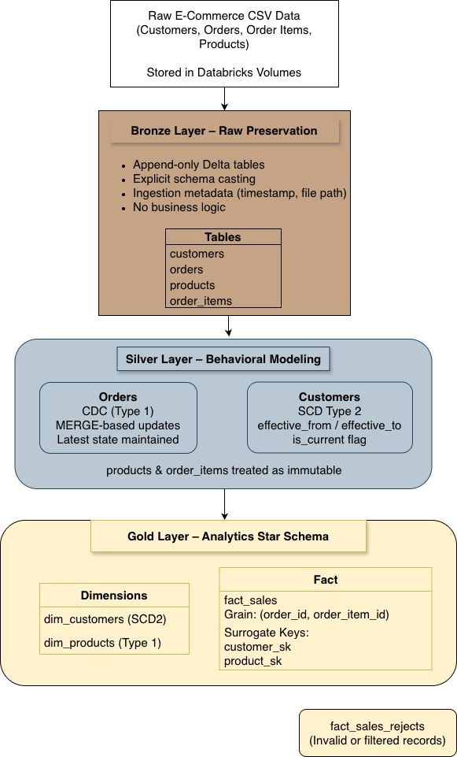
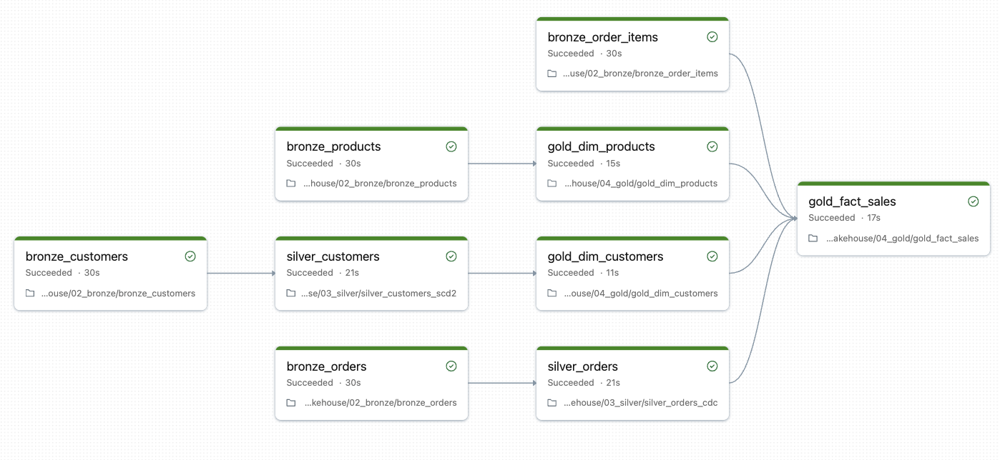
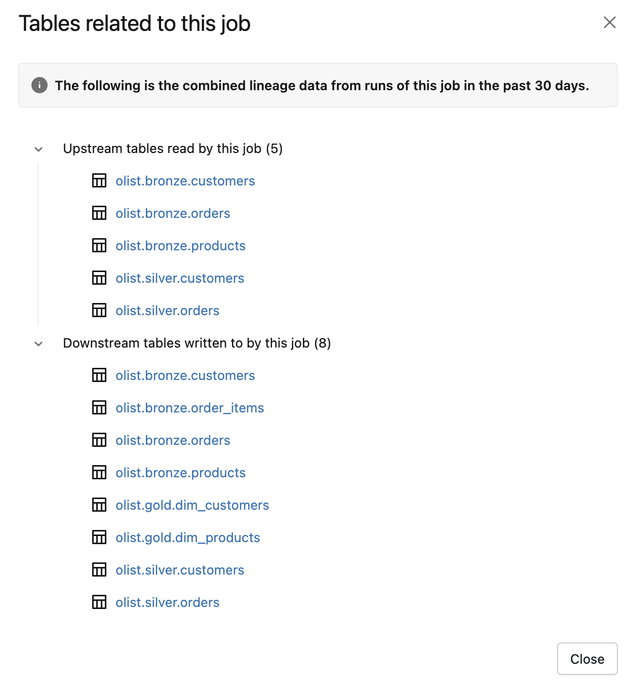

# Olist Lakehouse Project  
**Production-style Medallion Lakehouse implemented with CDC, SCD Type 2, and Incremental Processing using Databricks, Delta Lake, and PySpark with orchestration via Databricks Jobs.**

---

## 📌 Overview

This project demonstrates the design and implementation of a production-shaped Data Lakehouse using the Medallion Architecture (Bronze → Silver → Gold) on Databricks. This entire pipeline is designed using the Free version of Databricks so ingestion is directly performed inside Databricks Volumes but this pipeline also aligned for production architectures where Azure Data Factory can orchestrate ingestion into ADLS/Databricks Volume.

The objective is not just to ingest data, but to design a pipeline that is:

- Idempotent  
- Incremental  
- Layered with clear responsibility  
- Auditable  
- Modeled using star schema principles  

The dataset represents an e-commerce domain consisting of customers, orders, order items, and products.

---

## 🏗️ Architecture Overview

The project follows a Medallion (Bronze–Silver–Gold) Lakehouse architecture implemented using Databricks and Delta Lake.



---

## 🔄 Pipeline Orchestration (Databricks Jobs)

The entire pipeline is orchestrated using Databricks Jobs, with task-level dependency management reflecting upstream and downstream data lineage across Bronze, Silver, and Gold layers.

- Parallel Bronze ingestion  
- Layer-based task dependencies  
- Retry configuration for failure resilience 
- Fact grain uniqueness is enforced prior to MERGE to prevent ambiguous Delta updates.



---

## 🔍 Data Lineage (Unity Catalog)

Data lineage is traceable across all layers using Unity Catalog, enabling:

- Upstream/downstream dependency tracking  
- Impact analysis  
- Data governance visibility  

<p align="center">
  
</p>

---

## 🟤 Bronze Layer – Raw Preservation

**Purpose:** Preserve source data faithfully.

**Characteristics:**
- Append-only Delta tables  
- Explicit schema casting  
- Ingestion metadata (`ingestion_ts`, `source_file`)  
- No business logic  

**Tables:**
- customers  
- orders  
- order_items  
- products  

Bronze ensures traceability and serves as the single source of truth.

---

## ⚪ Silver Layer – Behavioral Modeling

**Purpose:** Model data state and business behavior.

### Orders → CDC (Type 1)
- MERGE-based incremental processing  
- Latest state maintained  
- Idempotent re-runs  

### Customers → SCD Type 2
- Historical tracking of changes  
- `effective_from` / `effective_to` timestamps  
- `is_current` flag  
- Two-step expire-and-insert strategy  

Products and order_items are treated as immutable in this implementation.

---

## 🟡 Gold Layer – Analytics Star Schema

**Purpose:** Provide analytics-ready, consumption-safe data.

### Dimensions
- `dim_customers` (SCD Type 2)  
- `dim_products` (Type 1)  

### Fact
- fact_sales
- Grain: (order_id, order_item_id)
- Surrogate keys: customer_sk, product_sk
- Watermark-based incremental processing
- Temporal joins to SCD Type 2 customer dimension
- Conditional Delta MERGE updates

### Data Quality
- `fact_sales_rejects` captures invalid or filtered records  
- No silent data loss  

Gold enforces a clear separation between descriptive attributes (dimensions) and measurable events (fact).

---

## 🔄 Incremental Processing Strategy

The pipeline is designed to be safely re-runnable.

- Bronze: Append-only ingestion
- Silver Orders: CDC-style MERGE processing
- Silver Customers: SCD Type 2 history tracking
- Gold Dimensions: Incremental surrogate key maintenance
- Gold Fact: Watermark-based processing with conditional Delta MERGE

All transformations are idempotent and support incremental updates.

---

## 📊 Data Modeling Highlights

- Clear layer responsibility separation  
- Star schema modeling  
- Strict fact grain definition  
- Surrogate key usage in dimensions  
- Explicit reject handling for data quality transparency  

---

## ⚡ Performance & Scalability

- Incremental processing using watermark-based filtering
- Change-driven processing to avoid historical recomputation
- Conditional Delta MERGE updates to reduce unnecessary rewrites
- Stable surrogate key management for SCD Type 2 dimensions
- Fact grain uniqueness validation before MERGE execution

---

## ⚙ Configuration

The project uses a centralized configuration file:

```
config/config.yaml
```

Configuration includes:

- Schema names (bronze, silver, gold)  
- Raw data paths  
- Table names  

This prevents hard-coded values inside transformation scripts and improves maintainability.

---

## 📂 Project Structure

```text
olist_lakehouse/
│
├── architecture/                 # Visual documentation
│   ├── olist_lakehouse_architecture.png
│   ├── databricks_job_dag.png
│   └── lineage_view.png
│
├── bronze/                       # Raw ingestion layer (append-only)
│   ├── bronze_customers.py
│   ├── bronze_orders.py
│   ├── bronze_products.py
│   └── bronze_order_items.py
│
├── silver/                       # Business logic layer
│   ├── silver_orders_cdc.py      # CDC Type 1 (MERGE-based updates)
│   └── silver_customers_scd2.py  # SCD Type 2 implementation
│
├── gold/                         # Analytics layer (Star Schema)
│   ├── gold_dim_customers.py
│   ├── gold_dim_products.py
│   └── gold_fact_sales.py
│
├── config/                       # Centralized configuration
│   ├── config.yaml
│   └── config_loader.py
│
├── requirements.txt
└── README.md
```

---

## 🛠 Tech Stack

- Databricks  
- Apache Spark (PySpark)  
- Delta Lake  
- Medallion Architecture  
- Star Schema Modeling  
- Databricks Jobs (Workflow Orchestration)

---

## 🧪 Reproducibility

All configurations are centralized under `config/config.yaml`.  
No hardcoded paths or schema names exist in transformation logic.

---

## ⚙ Execution Environment

This project is designed to run within a Databricks environment where a Spark session is already available.

Although the repository is structured as a clean Python project for clarity and modularity, execution assumes:

- An active Spark session  
- Delta Lake support  
- Databricks Runtime  

The `.py` structure improves maintainability and version control, while execution remains cluster-based.

This repository focuses on architectural clarity and production-oriented design rather than local standalone execution.

---

## 🚀 Future Enhancements

- Metadata-based surrogate key allocator
- Delta Change Data Feed (CDF) integration
- CDC-driven ingestion from source systems
- Partitioning and performance optimization
- Airflow-based orchestration
- Data validation framework

---

## 💡 Design Principles

- Clear layer ownership  
- Idempotent processing  
- Incremental MERGE logic  
- Explicit data quality handling  
- Separation of ingestion, transformation, and analytics concerns  

---

## 🎯 Summary

This project demonstrates how backend engineering rigor can be applied to modern data engineering:

- Deterministic behavior  
- Explicit state management (CDC, SCD Type 2, and temporal joins)
- Controlled schema modeling  
- Transparent data quality handling  

The result is a structured, production-oriented lakehouse implementation rather than a simple ETL script collection.
